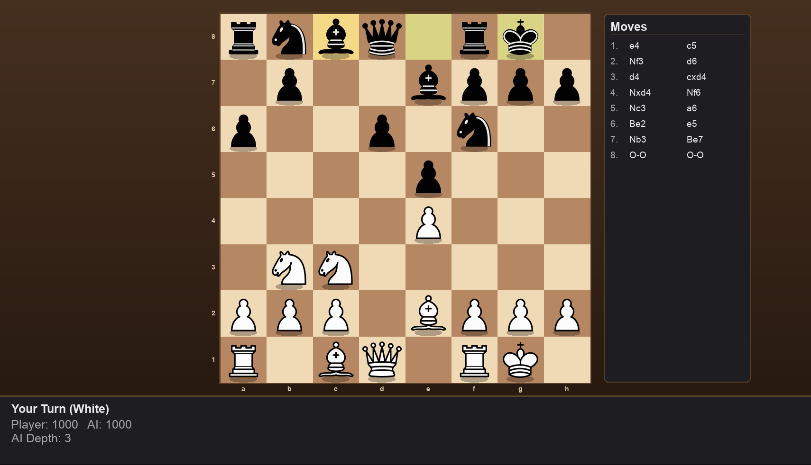

# AI Chess Elo

A single-player chess game with a full wooden board frame, the classic Staunton
piece set, a minimax AI opponent, and an Elo-style rating system calibrated to
feel like chess.com's rating scale.



## Features

- **Full chess rules** via [python-chess](https://python-chess.readthedocs.io/) — legal move generation, check/checkmate/stalemate detection, all the way down to en passant and promotion.
- **Polished board UI** — wooden frame with rank/file coordinates, drop shadows under every piece, a last-move highlight, and lichess-style move indicators (a dot for a quiet move, a ring for a capture).
- **Animated moves** — pieces slide to their destination square instead of snapping.
- **Minimax AI with alpha-beta pruning**, plus a move-ordering heuristic that favors captures/checks and penalizes repetitive shuffling (moving the same piece back and forth).
- **Elo rating system calibrated to chess.com's scale.** Your rating starts at 1000, and the AI's search depth scales in ~400-point bands to roughly match chess.com's skill tiers:

  | Rating range | AI depth | Tier |
  |---|---|---|
  | < 600 | 1 | Beginner |
  | 600–999 | 2 | Novice |
  | 1000–1399 | 3 | Intermediate |
  | 1400–1799 | 4 | Advanced |
  | 1800+ | 5 | Expert |

  So a genuinely 1000-rated player faces a moderate opponent (depth 3), not the AI's maximum strength.
- **Persistent rating and game history.** Your rating and a log of past games (date, result, rating before/after) are saved to disk after every game and reloaded on launch — the start screen shows a "Recent Games" card with color-coded rating deltas.
- **Two ways to start:**
  - **Continue** — resume at your saved rating.
  - **Recalibrate** — reset to the 1000 baseline and play a fresh calibration game to re-rank from scratch.
- **Replay mode** — after a game ends, replay the entire game move-by-move.
- **Game Review** — like chess.com's post-game analysis: every move you made gets scored 1–10 (based on how much evaluation you gave up compared to the engine's best move at that position), with blunders (≤3) highlighted red and excellent moves (9–10) highlighted green.
- **Fullscreen.** Press **F11**, drag to resize, or use the native macOS fullscreen button — the board, panel, and every screen (menu, game, review) reflow and rescale to fit.

## Controls

- **Mouse** — click a piece, then click a highlighted square to move it.
- **R** — reset the current game.
- **F11** — toggle fullscreen.
- On the game-over screen, click **Replay** to watch the game again, or **Review** to see every move scored.

## Running from source

```bash
pip install -r requirements.txt
python3 chess_game.py
```

Run the rating-curve simulation (no GUI) with:

```bash
python3 chess_game.py simulate
```

## Building a standalone macOS app

```bash
pip install pyinstaller
pyinstaller --windowed --name "AI Chess Elo" --icon assets/AppIcon.icns --add-data "assets/pieces:assets/pieces" chess_game.py
```

This produces `dist/AI Chess Elo.app`, which you can drag into `/Applications`
and launch like any other app — no terminal required.

## Where your rating is stored

Your rating persists at:

```
~/Library/Application Support/AI Chess Elo/ratings.json
```

Deleting this file has the same effect as choosing "Recalibrate" from the start menu.

## How the rating updates

After each game, your rating is adjusted with a standard Elo expected-score formula,
but the K-factor (how much a single result moves your rating) is scaled by how the
game went:

- Fast losses are penalized hard (K up to 600) — the system assumes a quick loss with
  very few pieces moved means the result wasn't a fair fight.
- Wins and draws use smaller K-factors that shrink further the longer the game goes.

The AI's rating is always kept equal to your own after your first (calibration) game,
so its search depth — and therefore its difficulty — tracks your rating directly.

## How move review scoring works

For each move you played, the engine searches every legal alternative at that
position (depth 2) and compares your move's resulting evaluation against the best
one found. The gap ("evaluation loss") maps to a 1–10 score — 0 loss is a 10,
losing 600+ centipawns worth of evaluation is a 1. It's a heuristic based on this
game's own search, not a full engine analysis, but it reliably separates blunders
from good moves.

## Piece artwork

Pieces are the "cburnett" Staunton set created by Colin M.L. Burnett, sourced from
[Wikimedia Commons](https://commons.wikimedia.org/wiki/Category:SVG_chess_pieces)
(also used by Lichess). Licensed under CC BY-SA 3.0 / GFDL 1.2 / GPL2+; source SVGs
are included under `assets/pieces_svg/`.
